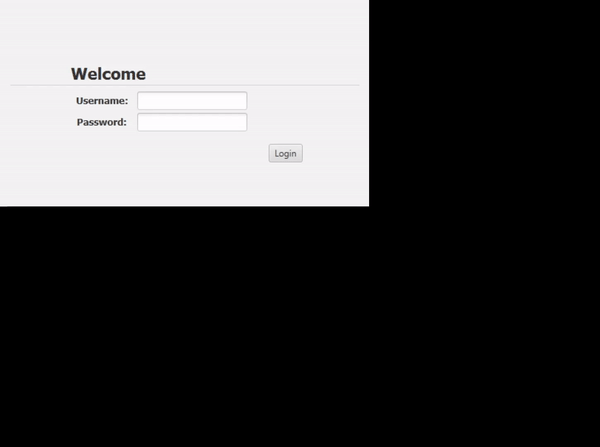

# GaritsGA

Team project application. Garage Assistant/Manager with local database. Languages: Java+ SQLite + FXML + JRXML. 

A Garage Assistant software that helps keep track of records (of customers, vehicles, jobs, payments, reminders, and parts) and produces reports (of invoices, job requests and stock ledgers). 



## Installation

Required Java Version: 11

Go to the link provided bellow to download the dependencies for this project:

```dependencies
https://www.dropbox.com/s/v05t4szftqciyn3/dependicies.zip?dl=0
```

Add the following directories in dependencies section:
- common-beanutils
- commons-collections
- commons-disgester
- commons-logging

Add the following as libraries:
- sqlite-jdbc-3.23.1
- itext-2.1.7.js4
- jasperreports-6.7.1\src

## Usage

Once the application is run the first time a database will be created with a default admin user. Admin Username: SYSDBA, Admin Password: Masterkey.

These are 5 roles within this application:
- Administrator: Deals with user accounts.
- Franchisee: Has full access to all features of the application.
- Foreperson: Manages and assigns jobs for mechanics.
- Mechanic: Completes Jobs and updates status.
- Receptionist: Deals with customers, produces reports, monitors job progress, stock control, and partially fills in the details for new jobs.

## Contribution

__primary role__ and __secondary role__, respectively.

- Tahmid Uddin - Deputy Manager and Programmer
- Khai Siow - Project Manager and Programmer
- Cameron Dennis - System Designer and Tester
- Manar Faid - System Designer and System Analyst
- Mahat Ahmed - System Analyst and Tester

## License
Our code is under [MIT](https://choosealicense.com/licenses/mit/).

__The code for the dependencies may differ.__
